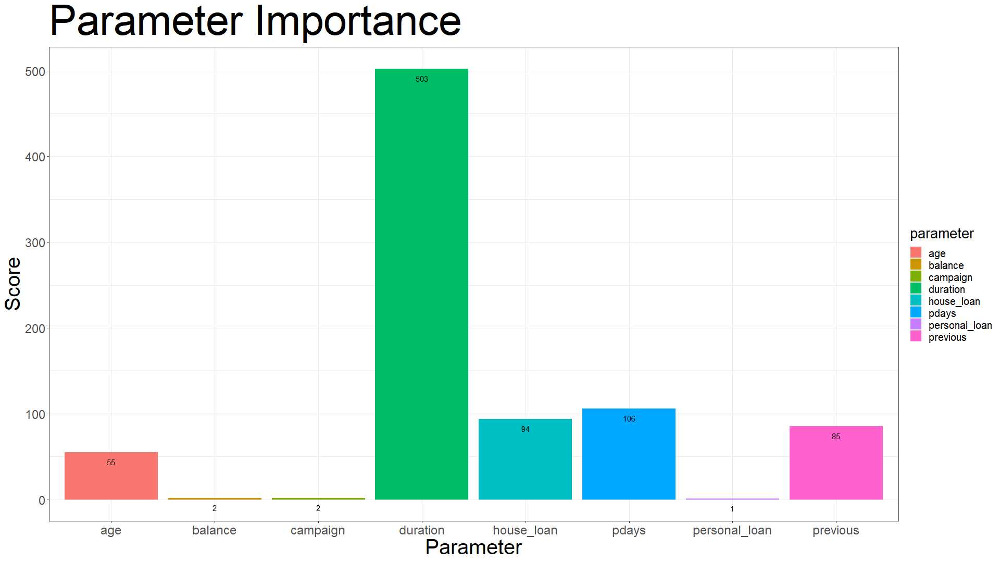
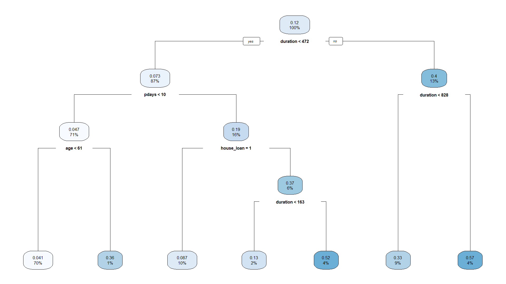
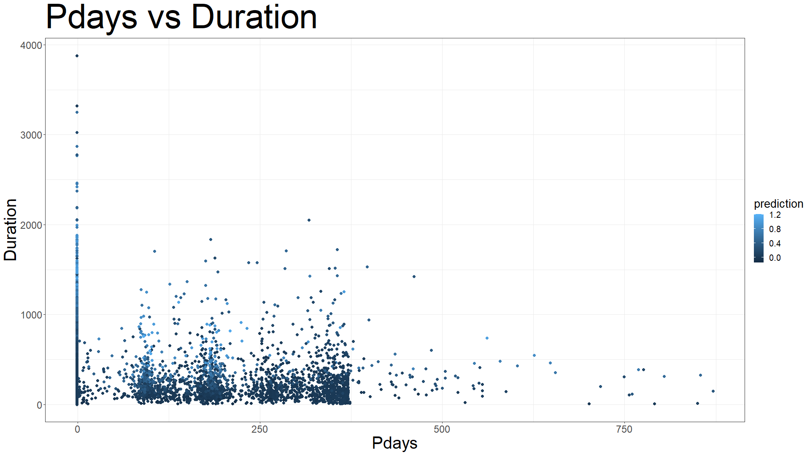
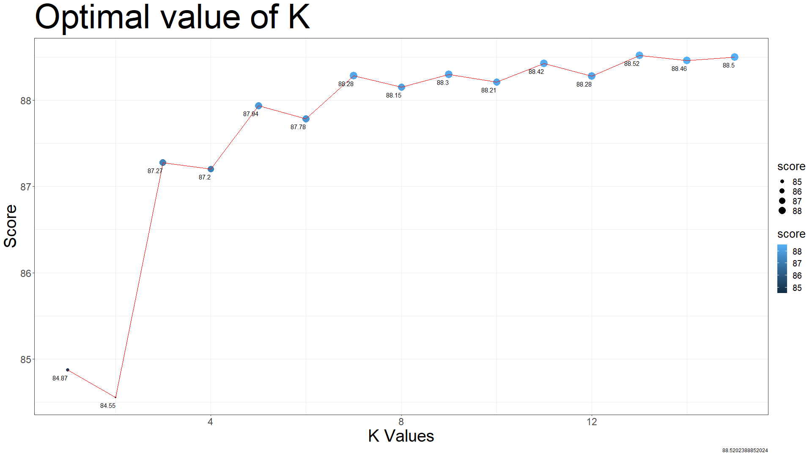
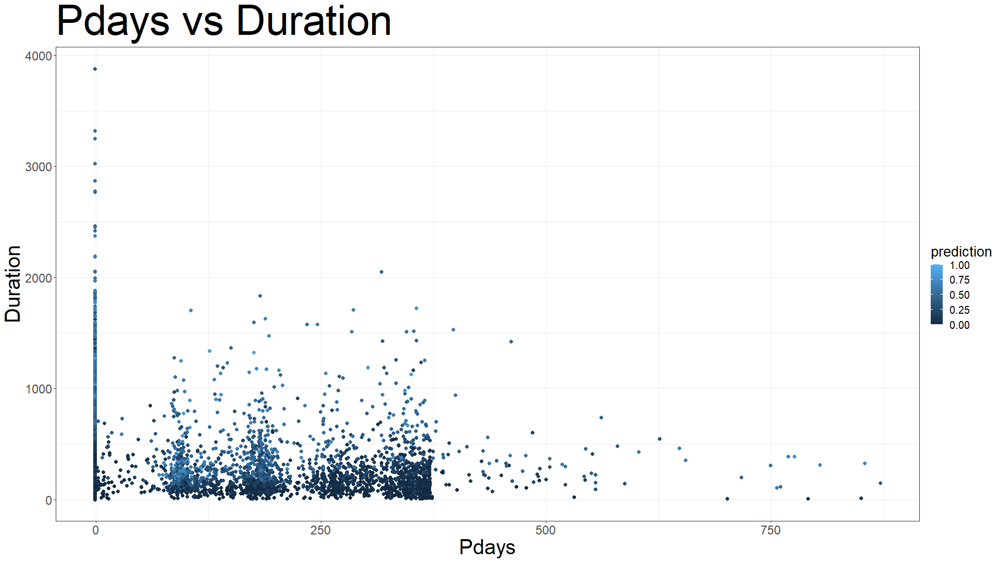

# Advanced Regression


Regression of sales data using KNN, SVM, and DTREE.

## Tech Stack


## Download

```bash
  git clone https://github.com/Onnamission/Advanced-Regression.git
```

## About

As we know that linear regression cannot be used in categorical values of a class. So, we think to use logisitc regression.
But sometime it is not an optimal choice. So, we need to use more advance machine leanring algorithm. Now, here comes the role of algorithms like - KNN, SVM and DTEE.
It is not mandatory to get best results all the time, but is useful is many cases. This time more parameters were considered for regression. Same dataset was used as in this [repository](https://github.com/Onnamission/Sales-Regression-Analysis.git).

## Difference between Regression and Classification

In regression, the class parameters should have contnious values. Eg: 1, 2, 3, 4, 5,....., and so on.

In classification, the class parameters should only have categorical values Eg: 0 and 1.

## Data Pipeline in R

```r
  data_clean = df %>%
    drop_na() %>%
    janitor::clean_names()
```

## Dataset

The dataset is related with direct marketing campaigns of a Portuguese banking institution. The marketing campaigns were based on phone calls. Often, more than one contact to the same client was required, in order to access if the product (bank term deposit) would be ('yes') or ('no') subscribed.

## Data Cleaning

Some of the parameters which were not of any use to me were removed.

```r
  subset(select = -c(job, marital, education, contact, day, month, poutcome))
```

Remaining parameter's string values were converted to numeric.

```r
  data_clean$term_deposit[data_clean$term_deposit == "yes"] = 1

  data_clean$term_deposit[data_clean$term_deposit == "no"] = 0

  data_clean$term_deposit = as.numeric(data_clean$term_deposit)
```

Columns were renmaed for better understanding

```r
  colnames(data_clean) = c("age",
                         "credit_default",
                         "balance",
                         "house_loan",
                         "personal_loan",
                         "duration",
                         "campaign",
                         "pdays",
                         "previous",
                         "term_deposit")
```

## Decision Tree (DTREE)

Decision tree builds regression or classification models in the form of a tree structure. It breaks down a dataset into smaller and smaller subsets while at the same time an associated decision tree is incrementally developed. The final result is a tree with decision nodes and leaf nodes.

Firsty the parameter used were compared on the basis of importance.



Then, the regression was applied. The CP value was dynamically selcted for which it has least error value.



## Support Vector Machine (SVM)

SVM works by mapping data to a high-dimensional feature space so that data points can be categorized, even when the data are not otherwise linearly separable. A separator between the categories is found, then the data are transformed in such a way that the separator could be drawn as a hyperplane. Following this, characteristics of new data can be used to predict the group to which a new record should belong.

For the below graph, pdays and duration parameter were selected as they are top 2 most important parameters.



## K-Nearest Neighbour (KNN)

The k-nearest neighbors algorithm, also known as KNN or k-NN, is a non-parametric, supervised learning classifier, which uses proximity to make classifications or predictions about the grouping of an individual data point. While it can be used for either regression or classification problems, it is typically used as a classification algorithm, working off the assumption that similar points can be found near one another.

First, the optimal value of K was identified for which the score was highest. K = 13 came out to be best.



Then, the graph was plot using parameters - pdays and duration as it they are top 2 most important parameters.



## Support

For support, find me 😂.

## Authors

- [@Onnamission](https://www.github.com/Onnamission)

## Acknowledgements

 - [Dataset](https://archive.ics.uci.edu/ml/datasets/bank+marketing)
